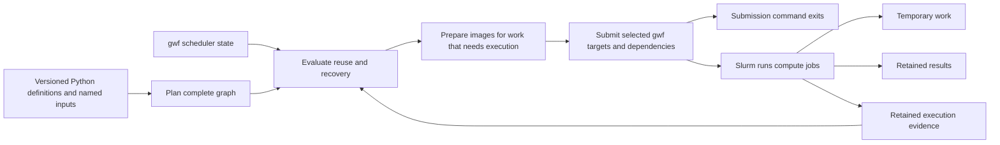

# gwflow architecture

The [requirements](design.md) define the intended behavior. This document
describes the architecture supported by the bounded Phase 0 feasibility work on
the selected Slurm, Apptainer, and BeeGFS configuration. Phase 1 is the next
implementation phase; the mechanisms below are not yet product code. The
[implementation plan](implementation-plan.md) records the feasibility gates and
product phases.

Current evidence and remaining gates are tracked in [Phase 0 results](phase0-results.md).

## Intended behavior

gwflow compiles versioned Python pipeline definitions into a complete gwf graph, evaluates completed subpipelines for reuse, submits the remaining work to Slurm, and exits. Slurm enforces execution dependencies. Existing compute jobs write their own execution evidence; no persistent controller, polling service, finalizer job, or image-preparation job is added.

Completed subpipelines remain reusable after their internal intermediates are removed. Reuse still respects the available gwf scheduler states, declared input bindings, upstream computation identity, retained outputs, and the agreed file-freshness rules. Missing required generated files or evidence causes automatic recovery; incomplete subpipelines resume through normal target scheduling. Cleanup is explicit.

Every target has its own optional Apptainer image. Local SIF and published registry images are supported. Targets without an image use the prepared host environment. gwflow does not create Conda environments or build images from custom recipes.



The diagram describes one invocation; the evidence is read again by a later user-invoked command. There is no background process following the arrows after the submission command exits.

## Language and identity

These terms are also recorded in [CONTEXT.md](../CONTEXT.md). The identity mechanism below remains subject to implementation validation.

| Term | Proposed meaning |
| --- | --- |
| Bound computation | A particular versioned subpipeline definition applied to named input bindings. It is the unit whose completed result can be reused. |
| Pipeline submission | A request to plan a main pipeline and submit whatever work is needed. It may reuse completed computations and already active jobs. |
| Execution attempt | An actual attempt to execute a target for a bound computation. Retries have new attempt identities while successful internal target work can remain from earlier attempts. |
| Result slot | The current retained result location for one bound computation. Rebuilding it does not automatically preserve a historical copy of its old files. |

A subpipeline version describes a fixed computational definition, including target commands, computational parameter values, output declarations, and **each target's image/environment declaration**. Input bindings vary independently. Main-pipeline versions describe the selected composition and enter provenance; changing the main version alone does not change the constituent computation identities.

### Computation descriptor

Propose a deterministic descriptor containing:

- A format/identity revision, subpipeline name, and explicit subpipeline version.
- Named, typed input bindings: file references, fixed lists of file references, and small JSON-compatible data values.
- For upstream inputs, the upstream bound-computation identity and declared output name.

Computational parameter values and declared target images are already covered by the immutable definition version. Store the compiled definition/target description for provenance and checking visible inconsistencies, but do not claim to discover arbitrary edits to hidden scripts or installed software. Published-definition immutability remains an author/release contract.

Use SHA-256 of the canonical **small descriptor** to name computation directories and associate records. This does not read or checksum input-file contents. Do not include current input sizes, input mtimes, job IDs, attempt IDs, or the main/gwflow/gwf release number merely to manufacture a new computation. Current file freshness is evaluated separately. An identity-format revision can change addressing when the representation itself is incompatible.

Proposed path rules: project-contained file bindings use normalized project-relative paths; external bindings use normalized absolute paths. Keep the declared lexical path meaningful, rather than silently equating every symlink alias. Resolve symlink destinations separately when preparing container mounts. A different file binding is different input identity even when bytes happen to match; cross-path content deduplication is outside the first release.

A changed upstream computation identity invalidates its consumers. If an upstream computation keeps its identity but needs rerunning because of freshness, missing outputs, or job failure, dependency-triggered rerunning propagates through the planned graph.

## Authoring model

Definitions are ordinary importable Python objects supplied by installed packages. They declare a name/version, named inputs, named retained outputs, and a builder that generates internal targets with explicit dependencies and resource requests. The main definition composes subpipeline definitions and connects retained outputs to named downstream inputs. One definition can be bound to many datasets.

Propose an initial file-oriented contract: finite declared file paths/lists and named data values; the whole target graph and output paths are known before submission. Directories containing runtime-discovered output sets should expose a declared manifest or known files initially. Cacheable work must have declared file results; external side effects without a reproducible file interface are not a first-release caching feature. Do not silently change gwf's always-run semantics for an outputless target by adding a receipt and calling it cacheable.

The following alignment example is a target-level illustration, not an implemented API:

| Target | Its image | Computational inputs | Output | Retention |
| --- | --- | --- | --- | --- |
| trim | `/images/cutadapt.sif` | reads | trimmed reads | temporary |
| align | `/images/bwa.sif` | trimmed reads, reference files | alignment SAM | temporary |
| sort | `/images/samtools.sif` | alignment SAM | alignment BAM | retained |
| index | `/images/samtools.sif` | alignment BAM | BAM index | retained |

The image is a **target field**, with no subpipeline-wide image inheritance. A registry URI can replace any local image path. The complete command specification for each target executes in its selected image. Separate targets do not share one persistent container.

Operational memory, walltime, partition, and account settings may change without a subpipeline version bump when they do not change the computation. Any result-affecting setting remains in the versioned definition.

## Components and boundaries

| Component | Responsibility |
| --- | --- |
| Definition planner | Resolve imports and input bindings, validate definition versions and interfaces, construct the complete computational graph and subpipeline membership. |
| Result state and reuse planner | Read required manifests/target evidence, evaluate status and freshness, choose whole-subpipeline reuse or ordinary recovery, and explain the decision. |
| gwf/Slurm adapter | Preserve gwf status precedence, construct the selected executable graph, add whole-subpipeline ordering, maintain target/job identities, submit and reconcile owned queued dependencies. |
| Target executor integration | Apply each target's prepared image and mounts, preserve command exit status, and write attempt-scoped evidence within the existing compute job. |
| Image preparation | Resolve local/registry image declarations, fetch/cache published images, and return compute-visible local SIF paths. |
| Project commands | Provide plan/run/status/cleanup entry points and coordinate project metadata/submission updates. |

Keep gwf-specific APIs and release-sensitive graph manipulation inside the adapter. Do not monkeypatch globally installed gwf or require unchanged legacy workflows. The released graph/scheduling surfaces are source-supported integration candidates, but their combination remains an experiment. See the [status investigation](research-gwf-status.md).

## Storage and retained evidence

Illustrative layout, proposed rather than implemented:

```text
project/
  work/<prefix>/<computation-id>/           # reusable internal work between retries
  results/<subpipeline>/<computation-id>/   # current retained result files
  .gwflow/
    computations/<computation-id>/         # required plan and target evidence
    submissions/<submission-id>/           # composition, job journal, diagnostics
    images/                                # prepared registry images and image index
    logs/                                  # execution/provenance logs
    locks/                                 # short command/cache coordination
```

Work and result roots can be configured to paths accessible from the submission host and relevant compute nodes. No particular filesystem product is prescribed. The implementation requires coherent path visibility, atomic same-filesystem publication of small metadata files, and reliable coordination between cooperating commands. On the selected BeeGFS deployment, cross-node `flock` and `lockf` did not coordinate, while atomic directory creation and atomic replacement did. Use fenced atomic-directory locks with owner/lease metadata and stale recovery there; filesystem capabilities must still be checked for any additional supported deployment. See the [Phase 0 E4 summary](phase0-results.md#e4--coordination-and-the-retry-gap).

The required computation manifest records the declared definition/input/output interface, target list, computational dependency links, and interpretation versions. Per-target evidence identifies the relevant execution attempt and its output paths/timestamps after the command and required output checks succeed. Job IDs and observations support scheduler checks and provenance. A small derived summary is optional and can be regenerated from intact underlying evidence.

Do not use a single Boolean completion marker as the sole authority. A saved command outcome is not proof of the job's eventual final Slurm state. Fresh scheduler queries take their normal precedence; a successfully queried absence of history differs from a query failure. Historical scheduler observations are provenance, not a new permanent failure/success override beyond gwf's behavior.

### Target attempts and required evidence

Before a target is submitted to modify its outputs, establish a new attempt identity and invalidate the previous evidence's eligibility for that target. The job's record must be associated with the expected attempt; a late old record cannot certify the new attempt. Publish replacement evidence only after the whole command returns successfully and required declared outputs are present. Required output checks and durable receipt publication must succeed before the existing compute job exits successfully; failure of either must make the job fail. This ensures Slurm's `afterok` dependencies include those obligations. Additional content validation stays with the pipeline author.

An absent required receipt must make its target eligible for rerunning, even if ordinary result files exist. The integration can represent this as a required metadata output or an equivalent validity predicate. **The receipt's own timestamp must not become an extra computational freshness input/output.** Otherwise metadata timing could cause reruns that original gwf would not, especially with preserved or future-dated data timestamps. This separation is a feasibility gate.

Known queued/running targets remain active even while outputs/receipts are absent. Known failed/cancelled targets follow gwf retry precedence. Missing required manifests or target evidence invalidates the affected reuse proof and schedules recovery automatically; reconstructing a definition's expected plan is not proof that its computation succeeded.

## Reuse and freshness algorithm candidate

The essential distinction is between assessing a completed subpipeline and scheduling work that will actually execute.

1. Compile the expected graph and load relevant target/job tracking. Query gwf backend states. Preserve dependency-triggered scheduling and gwf's own queued/running/failed/cancelled precedence.
2. A candidate completed subpipeline must have usable required evidence and all retained outputs. Missing evidence/output disqualifies whole-subpipeline reuse and triggers recovery. Available failed or active states cannot be hidden by pruning.
3. For candidate reuse, evaluate the original **target-level computational dependency graph**. Read real existence/mtimes for external inputs and retained outputs. For an absent disposable internal output only, valid evidence can supply its historical output mtime. If an internal output remains present, use its live state.
4. Apply gwf-compatible target freshness to those effective paths: missing required real outputs, then each target's newest computational input versus oldest computational output using strict `>`, together with dependency propagation. Do not pool all subpipeline inputs and outputs or compare current inputs for equality against saved input metadata.
5. If every required target satisfies the completed-boundary rules, omit that subpipeline's internal targets from the executable graph and expose its real retained outputs as existing inputs.
6. Otherwise include the subpipeline's full internal graph and use **real files** for ordinary recovery. Reuse current successful internal work where possible; regenerate missing producers and their dependents. If cleanup removed prerequisite intermediates, those producers must run again. A historical timestamp must never stand in for a file an executing command will physically read.

This deliberately confines virtual-file reasoning to the accepted completed-subpipeline boundary. It does not promise a general per-step cache capable of retaining deleted prerequisites during partial recovery. Missing producerless external inputs remain ordinary input errors; rerunning cannot recreate unavailable source data.

The virtual evaluation, evidence validity checks, and propagation into real scheduling are the largest unproven part of the design. The branch example `x=9 → a=10` and `y=11 → b=12` must stay current, while a genuinely newer relevant input must invalidate its path. The experiments also cover equal/future timestamps, failure states, and missing evidence.

## Whole-subpipeline ordering and submission

For each upstream/downstream subpipeline dependency, propose explicit scheduler edges from the downstream entry targets to every required upstream terminal target that remains in the execution graph. This covers parallel endings without a collector job. A previously completed/reusable producer contributes retained inputs instead of jobs.

Prefer scheduler-only edges over pretending every upstream output or receipt is a computational input. Update forward/reverse graph links, endpoints, and validation consistently. The extra ordering must not alter the timestamp comparison of unrelated file inputs. This adapter behavior needs a focused test against the pinned gwf release.

The submitting process plans, prepares necessary images, performs a final status/reuse evaluation under project coordination, journals and submits the full executable graph, persists tracking, and exits. Image preparation must cover the final execution set: if reevaluation discovers additional work, prepare its missing images and reevaluate before submission. Image acquisition can lengthen the initial command; no image-preparation job is submitted. Equivalent active work is reused by retaining its tracked job IDs and attaching new consumers to those jobs.

### Concurrency and interrupted submission

Serialize conflicting project planning/submission updates with a short-lived cooperative lock; do not hold it for the duration of compute jobs. On the selected BeeGFS filesystem this is an atomic-directory lease, not `flock`/`lockf`; the production protocol needs owner identity, expiry/heartbeat bounds, stale recovery, and fencing before publication. Coordinate image cache entries separately. Each submitted target has a stable project/computation/target name and an attempt token; journal intended submission and immediately record returned job IDs.

If a submission dies after Slurm accepted a job but before its ID was saved, reconcile owned scheduler jobs by their unambiguous names/tokens before submitting a duplicate. The exact Slurm tagging/reconciliation mechanism must be demonstrated. Missing tracking does not justify blindly duplicating active jobs. Scheduler query errors remain errors, rather than being treated as missing files or empty history.

When an upstream failed job is replaced, stock gwf can leave an existing queued consumer attached to the old job ID. On the selected Slurm configuration, `DependencyParameters=kill_invalid_depend` automatically cancels that consumer; ordinary gwf retry then submitted the replacement dependency chain successfully. The adapter should use that behavior when configured and observed. For a supported configuration where an obsolete consumer remains queued, identify affected **gwflow-owned queued consumers**, use the demonstrated controller-side PENDING-state filter to cancel only obsolete queued instances, and resubmit them with the new dependency IDs. Do not cancel unrelated or already-running work.

Inputs/definitions and referenced software artifacts must stay stable while work using them is active. The first release does not snapshot mutable external inputs or provide consistency for external writers changing those files during execution. Conflicting replacements of owned output paths while an existing computation consumes them require a clear adapter diagnosis; this is distinct from ordinary equivalent-job reuse.

## Target-specific Apptainer execution

Use gwf's released per-target Apptainer executor as the integration starting point. gwf's host Python wrapper remains outside the image; the entire target Bash specification and child commands run inside it. Compute nodes need Apptainer and the host Python/gwf/gwflow installation; images must contain the target's tools and Bash at the literal `/bin/bash` path used by gwf 2.1.1's generated script. Launch-side preparation must preflight that path. Preserve gwf's subprocess-exit behavior rather than silently adopting a different shell policy. See the [verified execution details](research-apptainer.md) and [Phase 0 E5 summary](phase0-results.md#e5--target-specific-executor-integration).

Proposed image preparation policy:

- Accept explicit local SIF paths and explicit registry URIs. A missing local file is not silently reinterpreted as a registry reference.
- Determine images needed by targets that must execute. Reused completed results and equivalent active jobs do not require unnecessary image downloads.
- Fetch/cache missing published registry images synchronously before their jobs are submitted, including Apptainer's OCI-to-SIF conversion. Publish fully prepared SIFs into a configurable compute-visible image directory; use temporary files and per-image coordination. Jobs receive local paths and need no registry network access for this flow.
- Resolve and record immutable registry identities where available. Freeze a cached reference within the project; do not poll mutable tags for updates on every submission. Deliberate software/image changes belong to a new image reference and subpipeline definition version. Local SIF immutability is an author-managed contract; no repeated large-file content fingerprint is introduced.
- Keep an image-reference lock/index so a deleted cache entry can be fetched again using the recorded resolved identity. Define unsupported/missing remote sources as acquisition errors, not invented environments. A separate image-cache cleanup policy can follow; ordinary work cleanup does not remove it.

Mount the execution script, declared helper assets, project/work/output paths, external input/reference paths, and resolved symlink destinations. Preserve path mappings and set the container working directory explicitly. Expose input/helper locations read-only where possible and required work/output locations read-write; merge overlapping binds without hiding writable output paths. Authors may declare additional required mounts or environment variables. Arbitrary undeclared paths embedded in command text cannot be reliably discovered.

Local image paths, registry tags/digests, cache locations, and bind rules are execution/provenance metadata. Target image declarations are part of the immutable subpipeline definition. No per-subpipeline image field or default inheritance is introduced.

## Results, cleanup, and recovery

Keep one current result slot for each bound computation. Different computation identities—including different subpipeline versions—have distinct slots. Rebuilding the same slot may replace its files; no automatic history of every prior payload is promised. Record attempt/submission provenance without claiming it preserves old inputs or result bytes.

Invalidate completion eligibility before rebuilding. Files may appear gradually and a partial old/new result set can be externally visible while the subpipeline is incomplete. Downstream execution and whole-subpipeline reuse remain gated. The initial release does not promise transactional replacement of the entire result directory.

The cleanup command evaluates completed/inactive eligibility using the same status/evidence rules, then removes only owned temporary work under the selected work root. It preserves retained outputs, required evidence, and provenance. Recheck ownership and activity under coordination; do not follow a work-tree symlink to delete an external input or result. A dry-run lists what would be removed. The image cache is a separate resource.

Missing required generated outputs/evidence automatically requests recovery. With intact required target evidence, a missing optional status summary is reconstructed. With missing indispensable target evidence, that target and the normal propagated dependents rerun. If a required whole-computation manifest cannot be recovered, the affected subpipeline cannot be certified from leftover files and is regenerated. No separate confirmation is required for this normal scheduling behavior.

## Software compatibility and packaging proposal

### Compatibility defaults

- Begin adapter work against **gwf 2.1.1**, pinned exactly in the first package proposal; widen the range only after running the adapter compatibility suite. The live gwf website mixes released and unreleased features, so use pinned source evidence.
- Propose Python **>=3.11** for the initial test matrix. Advertise only interpreter versions actually included in the tested release matrix; dependency resolution and runtime tests are release gates, not already established support.
- Record gwflow/gwf versions in provenance. Compatible upgrades do not automatically change computation identity or force reruns. Version metadata schemas and reuse semantics separately; translate known compatible representations, otherwise treat required evidence as unavailable and regenerate affected work under the current format.
- Pipeline packages declare compatible gwflow API requirements. An incompatible definition/API fails before scheduling with a dependency/version diagnostic. This differs from recoverable missing execution evidence.
- Do not promise unchanged legacy gwf authoring, backend independence, or automatic detection of mutations behind an unchanged definition version.

### gwflow package and release

Use `src/gwflow`, setuptools >=69 plus wheel, a dynamic package version from a
`_version.py` module, a CLI entry point, a synchronized conda recipe,
`noarch: python`, and import/CLI smoke tests. These conventions were inspected
in the separate public `MOMA-AUH/skua` project, which is a packaging reference,
not a gwflow dependency. The recipe declares `gwf ==2.1.1`; CI runs the real
tests as well as packaging checks. [Packaging reference evidence](source-findings.md#skua-verified-packaging-reference)

The **published** gwf 2.1.1 conda artifact is available from **gwforg**, with attrs, click, click-plugins, prettyprinter, and Python >=3.8 dependencies. Include `gwforg` in build/installation channels alongside the dependency channel; do not assume bioconda or conda-forge supplies gwf. A proposed development environment selects `gwforg::gwf=2.1.1` and installs gwflow editable. Conda is the supported initial installation path; pip-only dependency behavior needs its own verification because the inspected gwf Python metadata omits its runtime-dependency list. [Official release artifact metadata](https://api.anaconda.org/release/gwforg/gwf/2.1.1)

Use **micknudsen** as gwflow's intended release channel. This does not assert
existing publishing permission.
Tag-triggered CI builds and tests run before uploading, with a manual build and
test trigger also available. Credentials and publication configuration are
future release work.

### Definition packages

Use ordinary Python imports initially, with explicit definition names/versions and entry objects; no online registry service is needed. A distribution may contain several definitions. Its package release version is distinct from each subpipeline version and from the main composition version; packaging changes do not silently bump every computation version.

Main definitions select concrete subpipeline definition versions and verify that the installed exports match. Python dependency constraints or lock/environment files arrange installation; gwflow does not solve or create those environments. Editable installs support author development, with explicit development versions and clear provenance. Conda distribution of every pipeline package is not implied by choosing Python packages.

## First release and proposed non-goals

The minimum useful release includes Slurm submission, static Python definitions, independently versioned subpipelines, named file/data inputs, target-specific images, completed-boundary reuse, automatic missing-evidence recovery, partial retries, active-job reuse, whole-subpipeline barriers, retained provenance, plan/status output, and explicit cleanup. Container support belongs in this initial scope as requested, rather than being quietly deferred.

Proposed non-goals: persistent controllers or orchestration jobs; runtime graph expansion; global/multi-user result caching; input-content deduplication; snapshots of changing input files or every historical result; atomic whole-result publication; environment/custom-image builds; automatic tool fingerprinting; automatic cross-project relocation while jobs are active; arbitrary side-effect-only caching; and compatibility with unchanged legacy workflow files. Some are established constraints and others are explicit proposed first-release boundaries for overall review.

## Feasibility gates and review

The bounded Phase 0 work demonstrated cleanup-tolerant target-level freshness without stricter metadata comparisons; required-evidence regeneration without fabricated success; status-aware graph pruning; parallel-terminal barriers; interrupted/overlapping submission recovery; queued-consumer replacement/safe filtering; and per-target containers with real binds, image acquisition, and status propagation on the selected configuration. The failed BeeGFS advisory-lock and missing-`/bin/bash` assumptions produced the explicit refinements above. Packaging must still be tested with the actual gwforg artifact/channel in Phase 5.

The [implementation plan](implementation-plan.md) makes these bounded experiments Phase 0. [The results](phase0-results.md) distinguish demonstrated mechanisms from remaining product work. The refinements add no controller, extra job, checksum scan, or weakened scheduler semantics.
